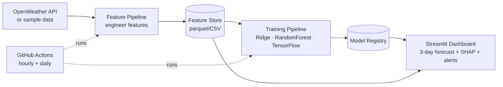

# 🌫️ Pearls AQI Predictor

Forecast the **Air Quality Index (AQI)** for **Karachi** over the next **3 days**, using an
end-to-end machine-learning pipeline: automated data collection → feature engineering →
model training → live predictions on an interactive dashboard.

The project runs **out of the box on realistic sample data** (no sign-ups needed), then
switches to **live data** with a single free API key. This makes it perfect for learning:
you see everything working first, then make it real.

---

## What it does



* **Feature pipeline** – pulls weather + pollutant data, computes time-based features
  (hour/day/month), lags, rolling averages, and the AQI change rate.
* **Feature store** – one central place for engineered features (a local file here; swap in
  Hopsworks/Vertex AI later by editing a single file, `src/feature_store.py`).
* **Training pipeline** – trains Ridge Regression, Random Forest and a TensorFlow neural
  network; evaluates each with **RMSE, MAE and R²**; registers the best.
* **Dashboard** – shows the current AQI, the 3-day forecast, exploratory charts,
  **SHAP / permutation** feature-importance explanations, and **hazard alerts**.
* **Automation** – GitHub Actions run the feature pipeline hourly and retrain daily.

---

## 🚀 Quick start (Windows + VS Code)

You already have Python, VS Code and Git installed — here's the whole thing start to finish.

### 1. Open the project

Open **VS Code** → **File ▸ Open Folder…** → select this `AQI PROJECT` folder.
Then open a terminal inside VS Code with **Terminal ▸ New Terminal** (or `` Ctrl+` ``).

### 2. Create and activate a virtual environment

A virtual environment keeps this project's packages separate from the rest of your system.

```powershell
python -m venv .venv
.venv\Scripts\Activate.ps1
```

> **If PowerShell says "running scripts is disabled"**, run this once, then try again:
> ```powershell
> Set-ExecutionPolicy -Scope CurrentUser -ExecutionPolicy RemoteSigned
> ```
> Or just use the simpler Command Prompt activation: `.venv\Scripts\activate.bat`

You'll know it worked when you see `(.venv)` at the start of your terminal line.

### 3. Install the libraries

```powershell
pip install -r requirements.txt
```

*(This takes a few minutes the first time.)*

> **Optional extras.** The project runs fully on Ridge + Random Forest out of
> the box. To also add a small TensorFlow neural network and SHAP-based
> explanations, run `pip install -r requirements-optional.txt`. TensorFlow only
> supports Python 3.9–3.11; if that install fails, no problem — the project
> detects it and works exactly the same with the core models.

### 4. Build everything and see the forecast

```powershell
python pipeline.py all
```

This builds the sample dataset, trains the models, and prints a 3-day AQI forecast.

### 5. Launch the dashboard

```powershell
streamlit run app/dashboard.py
```

Your browser opens at `http://localhost:8501` with the full interactive dashboard. 🎉

> **Tip:** In VS Code, click the Python version in the bottom-right status bar and pick the
> one inside `.venv` so the editor uses your project's environment.

---

## 🌐 Switching to live online data (free)

The project already fetches real data from the **OpenWeather Air Pollution API**
(a year of hourly pollutant history → daily → AQI). It just needs a free key, and
a ready-to-fill **`.env`** file is already in the project.

1. Create a free account at **https://home.openweathermap.org/users/sign_up**.
2. Copy your key from **https://home.openweathermap.org/api_keys**.
3. Open the **`.env`** file and paste your key after the `=` (no quotes, no spaces):
   ```
   OPENWEATHER_API_KEY=your_key_here
   ```
4. Check it works:
   ```powershell
   python pipeline.py test-api
   ```
   You're looking for **"✅ Success — live data is working!"**
5. Rebuild everything on live data:
   ```powershell
   python pipeline.py all
   ```

> A brand-new key can take 1–2 hours to activate, so it may show **401
> Unauthorized** at first — just wait a bit and re-run the check. Until a key is
> working (or if you skip this entirely), the project automatically uses realistic
> sample data, so nothing ever breaks.

---

## 🧰 Everyday commands

| Command | What it does |
| --- | --- |
| `python pipeline.py all` | Build data, train models, print forecast (start here) |
| `python pipeline.py test-api` | Check whether your live OpenWeather key works |
| `python pipeline.py backfill` | (Re)build the full historical feature set |
| `python pipeline.py features` | Run the feature pipeline (the hourly job) |
| `python pipeline.py train` | Retrain models and register the best |
| `python pipeline.py predict` | Print the 3-day forecast |
| `streamlit run app/dashboard.py` | Open the dashboard |
| `python tests/smoke_test.py` | Quick health-check of the core logic |

---

## 📁 Project structure

```
AQI PROJECT/
├── pipeline.py               # one command-line entry point for everything
├── requirements.txt          # core libraries (installs on any Python)
├── requirements-optional.txt # optional extras: TensorFlow + SHAP
├── .env.example              # copy to .env and add your API key
├── src/
│   ├── config.py             # all settings (city, paths, AQI bands) in one place
│   ├── aqi.py                # pollutant concentration -> US EPA AQI
│   ├── data_fetch.py         # OpenWeather API + realistic synthetic fallback
│   ├── features.py           # feature engineering (time, lag, rolling, change-rate)
│   ├── feature_store.py      # local feature store (swap for Hopsworks here)
│   ├── feature_pipeline.py   # fetch -> features -> store  (the hourly job)
│   ├── train.py              # train Ridge/RandomForest/TensorFlow, register best
│   ├── predict.py            # load model + features -> 3-day forecast
│   └── explain.py            # SHAP + permutation feature importance
├── app/
│   └── dashboard.py          # Streamlit dashboard
├── notebooks/
│   └── eda.py                # standalone exploratory data analysis
├── tests/
│   └── smoke_test.py         # fast sanity checks
├── data/                     # feature store + model registry (auto-created)
└── .github/workflows/        # hourly feature pipeline + daily training
```

---

## ⚙️ Automating it with GitHub Actions

1. Create a new repository on GitHub and push this project to it:
   ```powershell
   git init
   git add .
   git commit -m "Pearls AQI Predictor"
   git branch -M main
   git remote add origin https://github.com/<your-username>/aqi-predictor.git
   git push -u origin main
   ```
2. In the repo, go to **Settings ▸ Secrets and variables ▸ Actions** and add a secret
   named `OPENWEATHER_API_KEY` with your key.
3. That's it. The **Feature Pipeline** runs every hour and the **Training Pipeline** runs
   daily (see the **Actions** tab). You can also trigger them manually with **Run workflow**.

---

## ✅ How this maps to the project requirements

| Requirement | Where it lives |
| --- | --- |
| Fetch weather + pollutant data (AQICN/OpenWeather) | `src/data_fetch.py` |
| Time-based + derived features (AQI change rate) | `src/features.py` |
| Feature Store | `src/feature_store.py` (Hopsworks-ready) |
| Historical backfill | `python pipeline.py backfill` |
| Train Random Forest, Ridge, TensorFlow | `src/train.py` |
| Evaluate with RMSE, MAE, R² | `src/train.py` → `data/models/metrics.json` |
| Model Registry | `data/models/` + `registry.json` |
| Hourly feature pipeline + daily training (CI/CD) | `.github/workflows/` |
| Web dashboard with 3-day predictions | `app/dashboard.py` (Streamlit) |
| EDA | `notebooks/eda.py` + dashboard EDA panel |
| SHAP / feature importance | `src/explain.py` + dashboard panel |
| Hazardous-AQI alerts | dashboard alert banner |

---

## 🩹 Troubleshooting

* **`ModuleNotFoundError: No module named '...'`** — the libraries didn't finish
  installing into the virtual environment. Make sure `(.venv)` shows in your
  terminal, then run `python -m pip install --upgrade pip` followed by
  `pip install -r requirements.txt` and watch for a final `Successfully installed …`
  line (rather than a red error).
* **`pip install` fails with build errors** — you may be on a very new Python
  version that doesn't have prebuilt packages yet. Upgrading pip first
  (`python -m pip install --upgrade pip`) fixes most cases; if not, installing
  **Python 3.11 or 3.12** and recreating the venv is the most reliable fix.
* **`streamlit` is not recognised** — make sure the virtual environment is active
  (`(.venv)` shows in the terminal) and you ran `pip install -r requirements.txt`.
* **TensorFlow won't install** — that's completely fine. TensorFlow is an
  optional extra (`requirements-optional.txt`) and only supports Python
  3.9–3.11. The project detects when it's missing and simply trains Ridge +
  Random Forest instead. Everything else works.
* **`No trained model found`** — run `python pipeline.py all` once first, or click
  *"Build sample data & train model now"* in the dashboard.
* **Dashboard shows sample data** — that's expected until you add a working
  `OPENWEATHER_API_KEY` to `.env` (new keys can take an hour or two to activate).

---

*Built as an end-to-end, serverless-ready ML project. Start with sample data, then flip on
live data and cloud automation whenever you're ready.*
